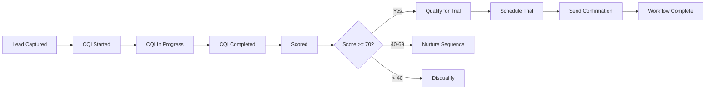
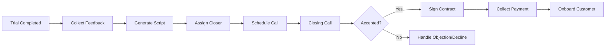

# CQI System Documentation

**Client Qualification Interview & Lead Conversion Automation**

Version: 1.0.0
Created: 2025-10-29
Author: Daniel Alvarez

---

## Table of Contents

1. [Overview](#overview)
2. [System Architecture](#system-architecture)
3. [Agents](#agents)
4. [Workflows](#workflows)
5. [Database Schema](#database-schema)
6. [Getting Started](#getting-started)
7. [Configuration](#configuration)
8. [Usage Examples](#usage-examples)
9. [API Reference](#api-reference)
10. [Monitoring & Analytics](#monitoring--analytics)
11. [Troubleshooting](#troubleshooting)
12. [Deployment](#deployment)

---

## Overview

The **CQI (Client Qualification Interview) System** is an AI-powered lead qualification and conversion automation platform designed for multi-brand service businesses. It intelligently qualifies leads, schedules trials, and automates the conversion process from initial contact to paying customer.

### Key Features

- ✅ **Intelligent Lead Qualification**: AI-powered scoring based on brand-specific criteria
- ✅ **Automated Trial Booking**: Seamless scheduling with confirmation and reminders
- ✅ **Personalized Closing Scripts**: AI-generated scripts based on CQI data and trial outcomes
- ✅ **Multi-Brand Support**: Separate configurations for SOTSVC, Boss of Clean, BeatSlave, Temple Builder
- ✅ **Workflow Automation**: Complete lead-to-trial and trial-to-paid workflows
- ✅ **Real-Time Dashboard**: Monitor performance, track conversions, identify bottlenecks
- ✅ **Audit Trail**: Comprehensive compliance and session documentation

### Supported Brands

| Brand | Services | Trial Type | Qualification Threshold |
|-------|----------|------------|------------------------|
| **SOTSVC** | Residential/Commercial Cleaning | $99 Trial Clean (60 min) | 70% |
| **Boss of Clean** | Pressure Washing | Free Estimate (45 min) | 60% |
| **BeatSlave** | Music Production | Free Consultation (30 min) | 50% |
| **Temple Builder** | Faith-Based Consulting | Free Assessment (60 min) | 80% |

---

## System Architecture

```
┌─────────────────────────────────────────────────────────────────┐
│                         CQI SYSTEM                               │
├─────────────────────────────────────────────────────────────────┤
│                                                                   │
│  ┌─────────────────┐  ┌──────────────────┐  ┌────────────────┐ │
│  │  Core Agents    │  │  System Agents   │  │  Utility Agents│ │
│  ├─────────────────┤  ├──────────────────┤  ├────────────────┤ │
│  │ • Conductor     │  │ • Startup Coord  │  │ • Dashboard    │ │
│  │ • Scorer        │  │ • Context Lib    │  │ • Workflow Mon │ │
│  │ • Trial Manager │  │ • Session Closer │  └────────────────┘ │
│  │ • Closer Script │  │ • Kingdom Closer │                      │
│  │ • Audit Report  │  └──────────────────┘                      │
│  └─────────────────┘                                            │
│                                                                   │
│  ┌──────────────────────────────────────────────────────────┐   │
│  │              Automated Workflows                          │   │
│  ├──────────────────────────────────────────────────────────┤   │
│  │  Lead → CQI → Score → Trial → Confirm → Follow-up        │   │
│  │  Trial → Feedback → Script → Close → Payment → Onboard   │   │
│  └──────────────────────────────────────────────────────────┘   │
│                                                                   │
└─────────────────────────────────────────────────────────────────┘
                              ▼
┌─────────────────────────────────────────────────────────────────┐
│                      SUPABASE DATABASE                           │
├─────────────────────────────────────────────────────────────────┤
│  Tables: leads, cqi_sessions, cqi_responses, trials,            │
│          closer_scripts, audit_reports, workflow_instances       │
└─────────────────────────────────────────────────────────────────┘
                              ▼
┌─────────────────────────────────────────────────────────────────┐
│                  INTEGRATIONS & SERVICES                         │
├─────────────────────────────────────────────────────────────────┤
│  • Anthropic Claude (AI)  • Stripe (Payments)                   │
│  • Twilio (SMS - Future)  • Google Calendar (Future)            │
└─────────────────────────────────────────────────────────────────┘
```

---

## Agents

### Core CQI Agents

#### 1. CQI Conductor
**File**: `agents-core/cqi/cqi-conductor.yml`
**Role**: Master orchestrator

- Manages entire CQI workflow
- Coordinates all other agents
- Handles multi-brand context switching
- Routes leads based on qualification score

#### 2. CQI Scorer
**File**: `agents-core/cqi/cqi-scorer.yml`
**Role**: Qualification scoring

- Analyzes CQI responses
- Applies weighted scoring criteria
- Identifies red/green flags
- Recommends action (trial|nurture|disqualify)

**Scoring Criteria** (Default Weights):
- Budget Alignment: 25%
- Urgency: 20%
- Decision Authority: 20%
- Fit Quality: 15%
- Engagement Level: 10%
- Contact Quality: 10%

#### 3. Trial Manager
**File**: `agents-core/cqi/trial-manager.yml`
**Role**: Trial scheduling and management

- Schedules trial appointments
- Sends confirmations and reminders
- Manages rescheduling
- Collects post-trial feedback
- Tracks trial outcomes

#### 4. Closer Script Generator
**File**: `agents-core/cqi/closer-script.yml`
**Role**: Personalized closing scripts

- Generates custom closing scripts
- Incorporates CQI and trial data
- Provides objection handlers
- Recommends pricing packages
- Tailors to brand and context

#### 5. Audit Report Agent
**File**: `agents-core/cqi/audit-report.yml`
**Role**: Compliance and documentation

- Generates session audit reports
- Ensures compliance
- Tracks all agent actions
- Provides analytics data
- Documents outcomes

### System Agents

#### 6. Startup Coordinator
**File**: `agents-core/system/startup-coordinator.yml`
**Role**: System initialization

- Validates environment
- Tests database connections
- Registers all agents
- Loads brand configurations
- Performs health checks

#### 7. Context Librarian
**File**: `agents-core/system/context-librarian.yml`
**Role**: Knowledge management

- Loads brand contexts
- Manages templates
- Serves FAQs
- Caches content
- Provides semantic search

#### 8. Session Closer
**File**: `agents-core/system/session-closer.yml`
**Role**: Session finalization

- Validates data persistence
- Schedules follow-ups
- Cleans up resources
- Updates session state

#### 9. Kingdom Closer
**File**: `agents-core/system/kingdom-closer.yml`
**Role**: System shutdown management

- Graceful shutdown
- Emergency shutdown
- Maintenance mode
- Session preservation
- Disaster recovery

### Utility Agents

#### 10. Dashboard
**File**: `agents-core/utils/dashboard.yml`
**Role**: Real-time monitoring

- Provides dashboard data
- Real-time metrics
- KPI tracking
- Performance reports
- Alert management

#### 11. Workflow Monitor
**File**: `agents-core/utils/workflow-monitor.yml`
**Role**: Workflow tracking

- Monitors workflow execution
- Detects failures and stuck workflows
- Tracks stage transitions
- Provides analytics
- Handles retries

---

## Workflows

### Lead-to-Trial Workflow
**File**: `agents-core/workflows/lead-to-trial.yml`



**Stages**:
1. **Lead Captured** - Validate data, check duplicates
2. **CQI Started** - Load brand context, initialize session
3. **CQI In Progress** - Conduct qualification interview
4. **CQI Completed** - All questions answered
5. **Scored** - Calculate qualification score
6. **Decision** - Route based on score
7. **Trial Scheduled** - Book appointment
8. **Confirmation Sent** - Email/SMS confirmations
9. **Complete** - Workflow finished

**SLA Targets**:
- Total Duration: 30 minutes (chat/phone)
- Lead to CQI Start: < 5 minutes
- CQI to Scored: < 20 minutes
- Scored to Trial: < 10 minutes

### Trial-to-Paid Workflow
**File**: `agents-core/workflows/trial-to-paid.yml`



**Stages**:
1. **Trial Completed** - Service complete
2. **Feedback Collection** - Post-trial survey
3. **Script Generation** - AI-generated closing script
4. **Assign Closer** - Assign to best closer
5. **Closing Call Scheduled** - Book callback
6. **Closing Call** - Conduct call
7. **Proposal Stage** - Present pricing
8. **Contract Signing** - Execute agreement
9. **Payment Collection** - Collect first payment
10. **Onboarding** - Welcome and schedule
11. **Complete** - Conversion successful

**SLA Targets**:
- Feedback within 1 hour of trial
- Script within 24 hours
- Closing call within 48 hours
- Total trial-to-paid: < 14 days

---

## Database Schema

### Core Tables

#### `public.leads`
Existing table - stores all incoming leads

#### `public.cqi_sessions`
Tracks CQI session lifecycle

```sql
- id (uuid)
- lead_id (uuid, FK)
- brand (text)
- session_state (enum: initiated, scored, actioned, documented, closed)
- outcome (enum: trial, nurture, disqualify)
- qualification_score (integer 0-100)
- score_breakdown (jsonb)
```

#### `public.cqi_responses`
Stores questions and answers

```sql
- id (uuid)
- session_id (uuid, FK)
- question_category (text)
- question_text (text)
- response_text (text)
- score_contribution (integer)
- red_flags (jsonb)
- green_flags (jsonb)
```

#### `public.trials`
Trial appointments and tracking

```sql
- id (uuid)
- lead_id (uuid, FK)
- brand (text)
- trial_type (text)
- scheduled_date (date)
- status (enum: scheduled, completed, cancelled, no_show)
- outcome (enum: converted, nurture, declined)
- feedback (jsonb)
```

#### `public.closer_scripts`
AI-generated closing scripts

```sql
- id (uuid)
- lead_id (uuid, FK)
- trial_id (uuid, FK)
- script_content (text)
- recommended_package (text)
- pricing_options (jsonb)
- objection_handlers (jsonb)
```

### Supporting Tables

- `public.services` - Service catalog
- `public.cqi_templates` - Question and email templates
- `public.audit_reports` - Audit trails
- `public.follow_up_tasks` - Scheduled follow-ups
- `public.workflow_instances` - Workflow tracking
- `public.system_events` - System logging

**See full schema**: `supabase/migrations/20251029000001_create_cqi_system_tables.sql`

---

## Getting Started

### Prerequisites

- Node.js 18+
- Python 3.10+
- Supabase account
- Anthropic API key
- Stripe account (optional for Phase 1)

### Installation

1. **Clone and navigate to project**:
```bash
cd AI-Command-Lab-
```

2. **Install dependencies**:
```bash
# Next.js frontend
cd next && npm install

# FastAPI backend
cd ../server && python3 -m venv .venv
source .venv/bin/activate
pip install -r requirements.txt
```

3. **Set up environment variables**:
```bash
# Copy shared config
cp .env.shared .env.local

# Edit with your actual values
nano .env.local
```

Required variables:
- `SUPABASE_URL`
- `SUPABASE_ANON_KEY`
- `ANTHROPIC_API_KEY`
- `BRAND_CONTEXT_PATH=./projects`

4. **Run Supabase migrations**:
```bash
# Apply CQI system schema
supabase db push

# Or manually via Supabase dashboard:
# Copy/paste contents of supabase/migrations/20251029000001_create_cqi_system_tables.sql
```

5. **Start services**:
```bash
# Terminal 1: FastAPI backend
cd server
source .venv/bin/activate
python3 -m uvicorn app:app --reload --host 0.0.0.0 --port 8000

# Terminal 2: Next.js frontend
cd next
npm run dev
```

6. **Access**:
- Frontend: http://localhost:3000
- Backend API: http://localhost:8000
- API Docs: http://localhost:8000/docs

---

## Configuration

### Brand Configuration

Each brand has its own configuration file:

- [projects/sotsvc/.agents/brand-config.yml](projects/sotsvc/.agents/brand-config.yml)
- [projects/boss-of-clean/.agents/brand-config.yml](projects/boss-of-clean/.agents/brand-config.yml)
- [projects/beatslave/.agents/brand-config.yml](projects/beatslave/.agents/brand-config.yml)
- [projects/temple-builder/.agents/brand-config.yml](projects/temple-builder/.agents/brand-config.yml)

**Configuration includes**:
- Services and pricing
- Trial details
- CQI questions and scoring weights
- Email templates
- Objection handlers

### Customizing Scoring

Edit brand config to adjust qualification thresholds:

```yaml
cqi_settings:
  qualification_threshold: 70  # Adjust per brand
  scoring_weights:
    budget_alignment: 25  # Adjust weights
    urgency: 20
    decision_authority: 20
```

### Adding New Questions

Add to brand config:

```yaml
cqi_settings:
  questions:
    new_category:
      - "Your new question here?"
      - "Another question?"
```

---

## Usage Examples

### Example 1: New Lead Arrives

```javascript
// 1. Lead submits contact form
POST /api/lead
{
  "name": "John Doe",
  "email": "john@example.com",
  "phone": "407-555-1234",
  "brand": "sotsvc",
  "message": "Need cleaning service"
}

// 2. CQI System automatically:
// - Creates lead record
// - Starts CQI session
// - Sends welcome email
// - Begins qualification questions

// 3. After Q&A, system scores lead:
// Score: 85/100 → Qualified!

// 4. System schedules trial:
// - Presents available times
// - Books appointment
// - Sends confirmation

// 5. Reminders sent automatically:
// - 24 hours before
// - 2 hours before

// 6. Post-trial:
// - Feedback requested
// - Closing script generated
// - Follow-up scheduled
```

### Example 2: Monitor Dashboard

```javascript
// Get dashboard data
GET /api/dashboard/executive?brand=sotsvc&time_range=month

// Response:
{
  "metrics": {
    "leads_processed": 150,
    "qualification_rate": 62.5,
    "trials_booked": 75,
    "trial_to_paid_rate": 48.0,
    "revenue_generated": 12500
  },
  "visualizations": {
    "funnel": [...],
    "trends": [...]
  }
}
```

### Example 3: Generate Closing Script

```javascript
// After trial completion
POST /api/agents/closer-script/generate
{
  "lead_id": "uuid",
  "trial_id": "uuid",
  "brand": "sotsvc",
  "agent_name": "Daniel"
}

// Response: Personalized script with:
// - Greeting
// - Value recap
// - Pricing presentation
// - Objection handlers
// - Closing questions
```

---

## API Reference

### Core Endpoints

#### Leads
- `POST /api/lead` - Create new lead
- `GET /api/lead/:id` - Get lead details
- `PUT /api/lead/:id` - Update lead

#### CQI
- `POST /api/cqi/start` - Start CQI session
- `POST /api/cqi/respond` - Submit response
- `GET /api/cqi/session/:id` - Get session details
- `POST /api/cqi/score` - Calculate score

#### Trials
- `POST /api/trials/schedule` - Schedule trial
- `GET /api/trials/:id` - Get trial details
- `PUT /api/trials/:id/feedback` - Submit feedback
- `POST /api/trials/:id/reschedule` - Reschedule

#### Closer Scripts
- `POST /api/closer-scripts/generate` - Generate script
- `GET /api/closer-scripts/:id` - Get script

#### Dashboard
- `GET /api/dashboard/:view` - Get dashboard data
- `GET /api/dashboard/real-time` - WebSocket for live updates

---

## Monitoring & Analytics

### Key Performance Indicators (KPIs)

| KPI | Target | Calculation |
|-----|--------|-------------|
| Qualification Rate | 60% | (Qualified / Total Leads) × 100 |
| Trial Booking Rate | 75% | (Trials Booked / Qualified) × 100 |
| Trial Completion Rate | 90% | (Completed / Scheduled) × 100 |
| Trial-to-Paid Rate | 50% | (Conversions / Completed) × 100 |
| Lead-to-Paid Rate | 25% | (Conversions / Total Leads) × 100 |

### Dashboard Views

1. **Executive**: High-level metrics, revenue, conversion rates
2. **Operations**: Active sessions, queue, agent utilization
3. **Sales**: Qualified leads, trials, opportunities
4. **Analytics**: Trends, sources, optimization insights

### Alerts

- **Stuck Workflows**: Stage duration > 2× timeout
- **High Failure Rate**: > 15% failures in 1 hour
- **Low Conversion**: Trial-to-paid < 30%
- **System Issues**: Database, API, agent failures

---

## Troubleshooting

### Common Issues

#### 1. CQI Session Not Starting

**Symptoms**: Lead created but no CQI session
**Causes**:
- Missing required lead fields
- Brand context not loaded
- Agent initialization failed

**Solutions**:
```bash
# Check lead data
SELECT * FROM public.leads WHERE id = 'lead-uuid';

# Check system events
SELECT * FROM public.system_events
WHERE event_type = 'error'
ORDER BY timestamp DESC LIMIT 10;

# Restart startup-coordinator agent
```

#### 2. Low Qualification Rate

**Symptoms**: < 40% of leads qualifying
**Possible Causes**:
- Threshold too high
- Scoring weights misconfigured
- Questions not aligned with ideal customer

**Solutions**:
- Review brand config qualification_threshold
- Analyze score_breakdown for patterns
- Adjust scoring weights
- Refine CQI questions

#### 3. Trials Not Converting

**Symptoms**: Low trial-to-paid rate
**Investigate**:
- Post-trial feedback scores
- Common objections
- Closer script effectiveness
- Follow-up timing

**Actions**:
```sql
-- Check trial outcomes
SELECT outcome, COUNT(*)
FROM public.trials
WHERE status = 'completed'
GROUP BY outcome;

-- Review decline reasons
SELECT report_data->>'primary_reason', COUNT(*)
FROM public.audit_reports
WHERE report_type = 'conversion'
  AND report_data->>'result' = 'declined'
GROUP BY report_data->>'primary_reason';
```

---

## Deployment

### Production Checklist

- [ ] Environment variables configured
- [ ] Supabase migrations applied
- [ ] RLS policies enabled (Phase 2)
- [ ] Stripe webhooks configured
- [ ] Email templates tested
- [ ] All agent health checks passing
- [ ] Dashboard accessible
- [ ] Monitoring and alerts configured
- [ ] Backup strategy implemented
- [ ] Documentation reviewed

### Deployment Steps

1. **Deploy Database**:
```bash
supabase db push --project-ref your-prod-ref
```

2. **Deploy Backend** (DigitalOcean):
```bash
# See CLAUDE.md for full deployment guide
```

3. **Deploy Frontend** (Netlify):
```bash
cd next
npm run build
netlify deploy --prod
```

4. **Verify**:
- Test lead submission
- Verify CQI flow
- Check trial booking
- Monitor dashboard

---

## Support & Contributing

### Getting Help

- **Issues**: Check [Troubleshooting](#troubleshooting)
- **Questions**: Review this documentation
- **Contact**: operations@sotsvc.com

### Version History

- **v1.0.0** (2025-10-29): Initial release
  - 11 agents implemented
  - 2 workflows operational
  - 4 brand configurations
  - Complete database schema

---

## License

Proprietary - AI Command Lab / SOTSVC
© 2025 Daniel Alvarez. All rights reserved.

---

**Built with**: Claude (Anthropic), Next.js, FastAPI, Supabase, Stripe
